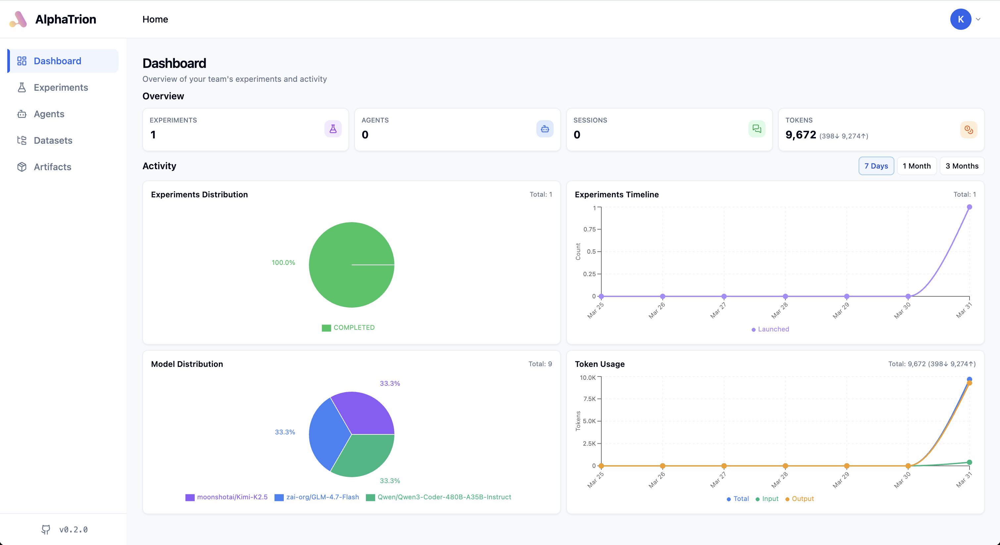
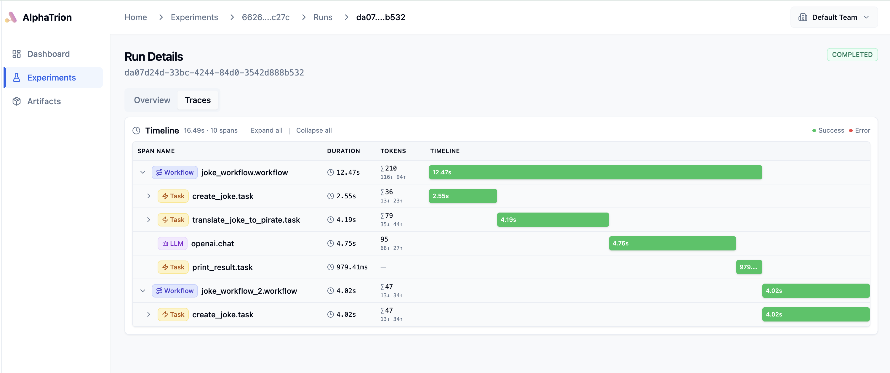

<p align="center">
  <picture>
    <source media="(prefers-color-scheme: dark)" srcset="https://raw.githubusercontent.com/inftyai/alphatrion/main/site/images/alphatrion.png">
    
  </picture>
</p>

<h3 align="center">
⚒️ The observability platform for agentic systems.
</h3>

[](https://github.com/mkenney/software-guides/blob/master/STABILITY-BADGES.md#alpha)
[](https://github.com/inftyai/alphatrion/releases/latest)

**AlphaTrion** is an open-source framework for building and optimizing GenAI applications. Track experiments, monitor performance, analyze model usage, and manage artifacts—all through an intuitive dashboard. Named after the oldest and wisest Transformer.

### Trusted By

<a href="https://hiverge.ai" target="_blank">
  
</a>

## Features

- **🔬 Experiment Tracking** - Organize ML experiments with hierarchical teams, experiments, and runs
- **📊 Performance Monitoring** - Track metrics, visualize trends, and monitor experiment status
- **🔍 Distributed Tracing** - Automatic OpenTelemetry integration for LLM calls with token usage and span analysis
- **🪝 Post-Run Hooks** - Automatically sync metadata and status after run completion
- **🎯 Interactive Dashboard** - Modern web UI for exploring experiments and traces
- **🔌 Easy Integration** - Simple Python API with async/await support

## Core Concepts

- **Organization** - Top-level entity for grouping teams and users
- **Team** - Collaborative workspace for organizing experiments and runs
- **User** - Individual account with secure authentication and team memberships
- **Experiment** - Logical grouping of runs with shared purpose, organized by labels
- **Run** - Individual execution instance with configuration and metrics

## Quick Start

### 1. Installation

```bash
# From PyPI
pip install alphatrion

# Or from source
git clone https://github.com/inftyai/alphatrion.git && cd alphatrion
source start.sh
```

### 2. Setup

```bash
# Start PostgreSQL, ClickHouse, and Registry
cp .env.example .env
make up

# Wait for services to be ready, then run migrations
make migrate-all

# Initialize your organization, team, and user account
alphatrion init
```

**Optional Tools:**
- pgAdmin: `http://localhost:8081` (alphatrion@inftyai.com / alphatr1on)
- Registry UI: `http://localhost:80`
- Grafana: `http://localhost:3000` (admin / admin) - LLM metrics dashboard
- Prometheus: `http://localhost:9090` - Metrics explorer

### 3. Run Your First Experiment

```python
import alphatrion as alpha
from alphatrion.experiment import CraftExperiment

# Initialize with your user ID
alpha.init(user_id="<your_user_id>")

async def my_task():
    # Your code here
    await alpha.log_metrics({"accuracy": 0.95, "loss": 0.12})

async with CraftExperiment.start(name="my_experiment") as exp:
    run = exp.run(my_task)
    await exp.wait()
```

### 4. Launch Dashboard

```bash
# Start backend server (terminal 1)
alphatrion server

# Launch dashboard (terminal 2)
alphatrion dashboard
```

Access the dashboard at `http://127.0.0.1:5173` and **log in with your email and password** to explore experiments, visualize metrics, and analyze traces.



### 5. View Traces

AlphaTrion automatically captures distributed tracing data for all LLM calls, including latency, token usage, and span relationships.



### 6. Using Post-Run Hooks (Optional)

Automatically sync metadata and status after run completion.

```python
from alphatrion.experiment import CraftExperiment
from alphatrion.run import PostRunHookFn

async def train_model():
    # Your training code
    return {
        "metadata": {"accuracy": 0.95, "loss": 0.05},
        "status": "COMPLETED",
    }

async with CraftExperiment.start("training") as exp:
    run = exp.run(
        train_model,
        post_run_hooks=[PostRunHookFn.sync_metadata, PostRunHookFn.sync_status]
    )
    await exp.wait()
```

### 7. Cleanup

```bash
make down
```

## References

- **Architecture**: [Diagrams](./docs/architecture/diagrams.md)
- **Dashboard**: [Setup Guide](./docs/dashboard/setup.md) | [CLI Reference](./docs/dashboard/dashboard-cli.md) | [Architecture](./docs/dashboard/dashboard-architecture.md)
- **Development**: [Contributing Guide](./docs/dev/development.md)
- **Claude Code Integration**: [Hooks Setup](./docs/CLAUDE_CODE_HOOKS.md)

## Contributing

We welcome contributions! Check out our [development guide](./docs/dev/development.md) to get started.

[](https://www.star-history.com/#inftyai/alphatrion&Date)
